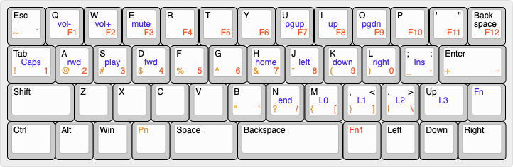

# vortex-core

Fn + D and connect with computer and put cys file on the board

[view in keyboard-layout-editor](http://www.keyboard-layout-editor.com/##@@_t=%23000000%0A%23c27600%0A%0A%23ff2e00%3B&=Esc%0A~%0A%0A%60&_t=%23000000%0A%23c27600%0A%0A%23ff2e00%0A%0A%0A%0A%0A%0A%23110fff%3B&=Q%0A%0A%0AF1%0A%0A%0A%0A%0A%0Avol-&=W%0A%0A%0AF2%0A%0A%0A%0A%0A%0Avol+&=E%0A%0A%0AF3%0A%0A%0A%0A%0A%0Amute&_t=%23000000%0A%23c27600%0A%0A%23ff2e00%3B&=R%0A%0A%0AF4&=T%0A%0A%0AF5&=Y%0A%0A%0AF6&_t=%23000000%0A%23c27600%0A%0A%23ff2e00%0A%0A%0A%0A%0A%0A%23110fff%3B&=U%0A%0A%0AF7%0A%0A%0A%0A%0A%0Apgup&=I%0A%0A%0AF8%0A%0A%0A%0A%0A%0Aup&=O%0A%0A%0AF9%0A%0A%0A%0A%0A%0Apgdn&_t=%23000000%0A%23c27600%0A%0A%23ff2e00%3B&=P%0A%0A%0AF10&_t=%23000000%0A%0A%0A%23ff2e00%3B&=Del%0A%0A%0AF11&=Back%0A%0A%0AF12%0A%0A%0Aspace%3B&@_t=%23000000%0A%23c27600%0A%0A%23ff2e00%0A%0A%0A%0A%0A%0A%23110fff&w:1.25%3B&=Tab%0A!%0A%0A1%0A%0A%0A%0A%0A%0ACaps&=A%0A%2F@%0A%0A2%0A%0A%0A%0A%0A%0Arwd&=S%0A%23%0A%0A3%0A%0A%0A%0A%0A%0Aplay&=D%0A$%0A%0A4%0A%0A%0A%0A%0A%0Afwd&_t=%23000000%0A%23c27600%0A%0A%23ff2e00%3B&=F%0A%25%0A%0A5&=G%0A%5E%0A%0A6&_t=%23000000%0A%23c27600%0A%0A%23ff2e00%0A%0A%0A%0A%0A%0A%23110fff%3B&=H%0A%2F&%0A%0A7%0A%0A%0A%0A%0A%0Ahome&=J%0A*%0A%0A8%0A%0A%0A%0A%0A%0Aleft&=K%0A(%0A%0A9%0A%0A%0A%0A%0A%0Adown&=L%0A)%0A%0A0%0A%0A%0A%0A%0A%0Aright&=%2F%3B%0A%2F_%0A%2F:%0A-%0A%0A%0A%0A%0A%0AIns&_t=%23000000%0A%23c27600%0A%0A%23ff2e00&w:1.75%3B&=Enter%0A+%0A%0A-%3B&@_t=%23000000&w:1.75%3B&=Shift&_t=%23000000%0A%23c27600%0A%0A%23ff2e00%3B&=Z&=X&=C&=V&_t=%23000000%0A%23e68800%0A%0A%23ff2e00%3B&=B%0A%22%0A%0A'&_t=%23000000%0A%23c27600%0A%0A%23ff2e00%0A%0A%0A%0A%0A%0A%23110fff%3B&=N%0A%3F%0A%0A%2F%2F%0A%0A%0A%0A%0A%0Aend&=M%0A%7B%0A%0A%5B%0A%0A%0A%0A%0A%0AL0&=,%0A%7D%0A%3C%0A%5D%0A%0A%0A%0A%0A%0AL1&=.%0A%7C%0A%3E%0A%5C%0A%0A%0A%0A%0A%0AL2&_t=%23000000%0A%0A%0A%0A%0A%0A%0A%0A%0A%23110fff&w:1.25%3B&=Up%0A%0A%0A%0A%0A%0A%0A%0A%0AL3&_t=%231400f7%3B&=Fn%3B&@_t=%23000000&w:1.25%3B&=Ctrl&=Alt&=Win&_t=%23c27600%3B&=Pn&_t=%23000000&w:1.75%3B&=Space&_w:2.75%3B&=Backspace&_t=%23d10000%3B&=Fn1&_t=%23000000%3B&=Left&=Down&_w:1.25%3B&=Right)
